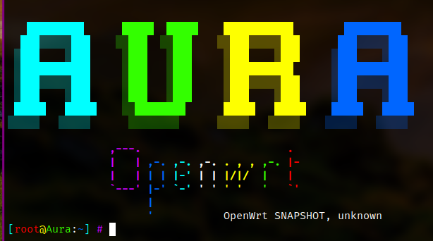

# 此项目来自 Openwrt 源码仓库分叉

## 特别提示

1. 源代码中绝不含任何后门和可以监控或者劫持你的 HTTPS 的闭源软件， SSL 安全是互联网最后的壁垒。安全干净才是固件应该做到的；

## 此套代码均皆指构建精简Openwrt镜像,所有不必要的宏,以及开关会禁用,所以你需要一点点时间去配置属于自己的固件配置!

## 注意
0. **最好使用本项目提供的docker 镜像，并启动容器编译，这样可以减少很多不必要的时间.**
1. **不要用 root 用户进行编译**
2. 国内用户编译前最好准备好梯子
3. 默认登陆IP 192.168.123.1 密码 whoami

## 注意
如果需要編譯X86的移動網絡luci app,請務必選擇5.15的內核.

## 说明:
1. 固件默认支持并启用IPV6支持.
2. 编译生成的固件不压缩,因为支持原汁原味.

## X86 AP热点开启方法.
Network->WirelessAPD ->Hostapd
hostapd-common

## 默认无线密码.
SSID:  Aura-💗-XXX
Wpa2/psk
KEY: 88888888

## 默认Lan侧ip.
172.17.17.1/24


## theme 配置说明.
Theme均来自互联网,其中argon主题冲突,所以此仓库会重名argon
一份为luci-theme-argon和luci-theme-lede-argon
```
只针对theme 升级,安装.
./scripts/feeds update -a theme
./scripts/feeds install -a theme
```
